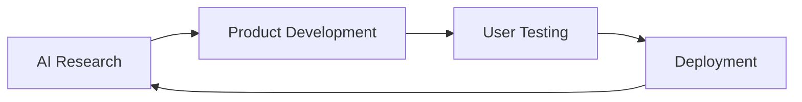

<div align="center">

# 👋 Welcome to my GitHub Profile

<p align="center">
  
</p>

---

## 🚀 About Me

<p align="center">
  <i>An arts student turned AI enthusiast, building the future one line at a time</i>
</p>

I'm a passionate **Arts student** from **Barmer, Rajasthan, India** who discovered a love for AI and technology. Despite having no formal tech background, I leverage AI to create:

- 🤖 **AI Bots & Chatbots**
- 🌐 **AI-powered Websites**
- 🧠 **Autonomous AI Agents**
- 🛠️ **Life-simplifying Tools**

My mission is to **make daily life easier** through AI while ensuring **user control and permissions** remain paramount.

---

## 🎯 My Philosophy

```diff
+ AI should serve humans, not replace them
+ User consent and control are non-negotiable
+ Technology should simplify, not complicate
+ Innovation should be accessible to everyone
```

---

## 🛠️ What I Build

<p align="center">
  
</p>

---

## 🌟 Featured Projects

### 🤖 AI-Powered Solutions
Creating intelligent systems that understand and assist users

### 🎨 No-Code AI Development
Building complex AI solutions without traditional programming

### 🔧 User-Centric Design
Ensuring every product respects user autonomy and permissions

---

## 📊 GitHub Stats

<p align="center">
  
  
</p>

---

## 🎯 Current Focus

<div align="center">



**Building autonomous AI systems that enhance human productivity while maintaining ethical boundaries**

</div>

---

## 📈 Learning Journey

<p align="center">
  
</p>

---

## 🤝 Let's Connect

<p align="center">
  <a href="https://github.com/rawalsinghpsnl">
    
  </a>
</p>

---

## 🎨 Interactive Dashboard

<p align="center">
  <a href="https://rawalsinghpsnl.github.io/rawalsinghpsnl/dashboard.html">
    
  </a>
</p>

<p align="center">
  <i>Check out my animated professional dashboard with live stats and interactive elements!</i>
</p>

<p align="center">
  <a href="https://rawalsinghpsnl.github.io/rawalsinghpsnl/">
    
  </a>
</p>

---

## 🎨 Fun Facts

- 🎓 **Arts Background** | Proving creativity meets technology
- 🏜️ **From Rajasthan** | Bringing desert innovation to global AI
- 🤖 **AI-First Approach** | Using AI to build AI solutions
- 🔒 **Privacy Advocate** | User control is my priority

---

<div align="center">

### 💡 "The best AI is the one that empowers humans to do more, not one that replaces them"

<p align="center">
  
</p>

</div>

---

<div align="center">

**⭐ Star this repo if you find my journey inspiring!**

</div>

</div>